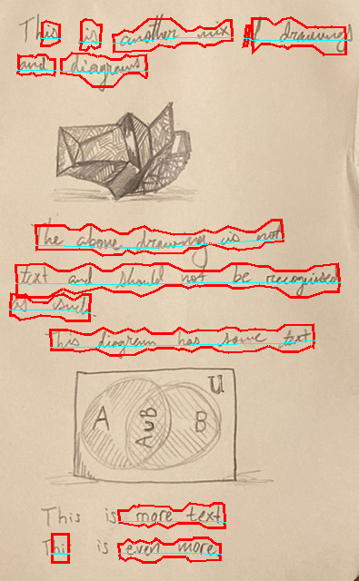
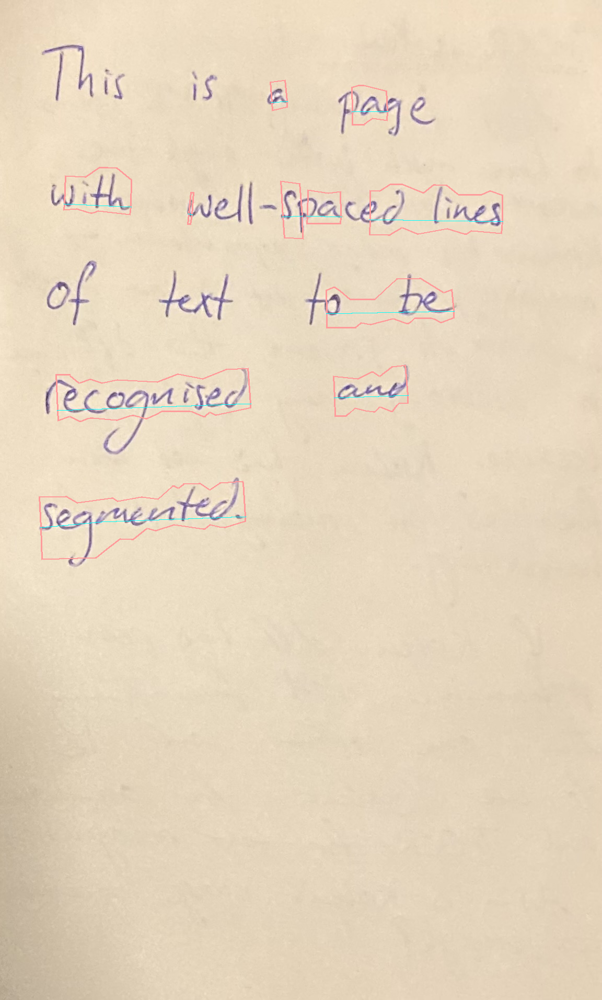
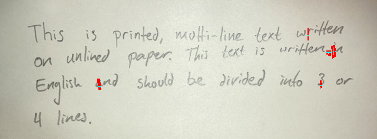
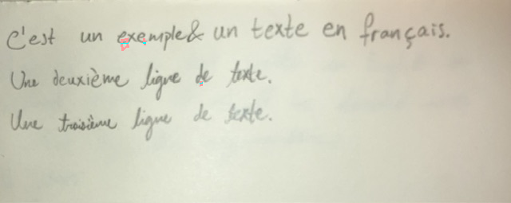

# HTR model comparison

This repository compares Kraken and TrOCR for French-language HTR (Handwritten Text Recognition).

## Overview

|   | Kraken | TrOCR |
|---|---|---|
| Built-in image segmentation | Yes/low quality | No |
| Exportable[^1] | [No](https://github.com/mittagessen/kraken/issues/614) | Probably[^2] |
| Single-line performance estimate[^3] | $$0.3 \frac{\text{seconds}}{\text{sample}}$$ | $$2.9 \frac{\text{seconds}}{\text{sample}}$$ |
| Segmentation performance estimate | 30 s/image | N/A |

[^1]: For example, so that no Python interpreter is required to run the model.
[^2]: There exist [repositories](https://github.com/OvercookedOmelette/trocr-to-onnx/blob/main/trocr-small-printed-converter.ipynb) that export other TrOCR models to ONNX. As such, it seems probable that TrOCR models can be exported and used without a Python interpreter.
[^3]: Does not include segmentation. All performance estimates are rough estimates.

## Image segmentation vs single-line htr

**Image segmentation**: Breaking an image into different regions. For this task, breaking an image into lines of text.

**Single-line HTR**: Extracting text from a picture of **one line** of handwriting.

## Single-line accuracy comparison

### Kraken

**Model**: Existing model: ["Transcription model for Lucien Peraire's handwriting"](https://zenodo.org/records/8193498) model (see [kraken/fine-tune-kraken.ipynb](./kraken/fine-tune-kraken.ipynb)).  
**Trained on**: [Handwritten text (details)](https://github.com/alix-tz/peraire-ground-truth)  
**Evaluated on**: 50 lines from the [RIMES test dataset](https://huggingface.co/datasets/Teklia/RIMES-2011-line/viewer/default/test).

| | |
|---|---|
| CER (Character Error Rate) |	0.538811 |
| WER (Word Error Rate) |	1.007592 |
| Average Similarity (%) |	62.702178 |
| Average evaluation time (s)	| 0.282406 |

### TrOCR

**Model**: Fine-tuned version of [`microsoft/trocr-small-handwritten`](https://huggingface.co/microsoft/trocr-small-handwritten).  
**Trained on**: [RIMES training dataset](https://huggingface.co/datasets/Teklia/RIMES-2011-line/viewer/default/train). This is in addition to mostly English-language training from the original model.  
**Evaluated on**: 50 lines from the [RIMES test dataset](https://huggingface.co/datasets/Teklia/RIMES-2011-line/viewer/default/test).

| | |
|---|---|
| CER (Character Error Rate) |	0.295350 |
| WER (Word Error Rate) |	0.877660 |
| Average Similarity (%) |	76.271460 |
| Average seconds/sample (s) |	2.857143 |

## Single line examples

### Kraken

...

### TrOCR

...

## Kraken segmentation

**Kraken** contains built-in image segmentation. The default image segmentation model, however, may not work well enough on handwritten text.

Kraken's built-in image segmentation was found to work well on some images of handwritten text and not well on others:

| Image | Quality |
|----|----|
|  | Mostly correct ✅ |
|  | Mostly correct ✅ |
|  | Most text not recognised ❌ |
|  | No text recognised ❌ |
|  | No text recognised ❌ |

Above, lines are drawn around the text regions recognised by Kraken. If working correctly, each line of text should be within its own region. See [kraken/fine-tune-kraken.ipynb](./kraken/fine-tune-kraken.ipynb) for more examples.

**Possible future steps**:
- Try adjusting image shape/brightness/contrast before segmenting with Kraken.
- Fine-tune or [train a custom segmenter](https://kraken.re/main/ketos.html#segmentation-model-training).
- Try a different model/library (e.g. [LayoutLM](https://huggingface.co/docs/transformers/model_doc/layoutlm)).

## Additional notes

- Kraken:
	- According to the [README: MacOS/Linux only](https://github.com/mittagessen/kraken)
	- [Needs Python](https://github.com/mittagessen/kraken/issues/614)
	- Supports image segmentation
	- For test model, faster than TrOCR
- TrOCR:
	- Slower than Kraken
	- No built-in image segmentation
		- [One project](https://huggingface.co/spaces/AlhitawiMohammed22/HTD_HTR/blob/main/app.py) uses `resnet50` and `mobilnet_v3_large` for this (with `doctr`). I'm unsure how well these work.