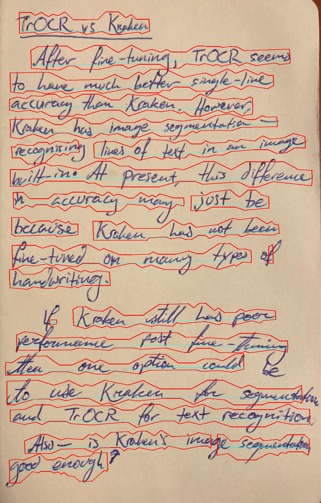
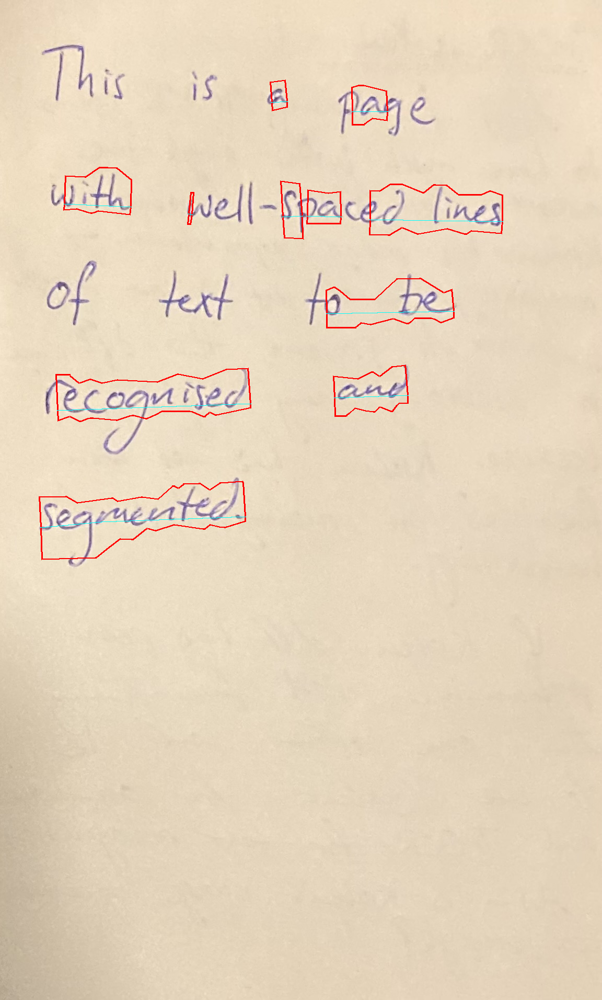
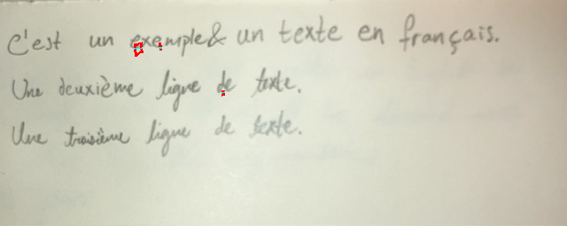

# HTR model comparison

This repository compares Kraken and TrOCR for French-language HTR (Handwritten Text Recognition).

## Overview

|   | Kraken | TrOCR |
|---|---|---|
| Built-in image segmentation | Yes/low quality | No |
| Exportable[^1] | [No](https://github.com/mittagessen/kraken/issues/614) | Probably[^2] |
| Single-line performance estimate[^3] | $$0.3 \frac{\text{seconds}}{\text{sample}}$$ | $$2.9 \frac{\text{seconds}}{\text{sample}}$$ |
| Segmentation performance estimate | 30 s/image | N/A |

[^1]: For example, so that no Python interpreter is required to run the model.
[^2]: There exist [repositories](https://github.com/OvercookedOmelette/trocr-to-onnx/blob/main/trocr-small-printed-converter.ipynb) that export other TrOCR models to ONNX. As such, it seems probable that TrOCR models can be exported and used without a Python interpreter.
[^3]: Does not include segmentation. All performance estimates are rough estimates.

## Image segmentation vs single-line htr

**Image segmentation**: Breaking an image into different regions. For this task, breaking an image into lines of text.

**Single-line HTR**: Extracting text from a picture of **one line** of handwriting.

## Single-line accuracy comparison

### Kraken

**Model**: Existing model: ["Transcription model for Lucien Peraire's handwriting"](https://zenodo.org/records/8193498) model (see [kraken/fine-tune-kraken.ipynb](./kraken/fine-tune-kraken.ipynb)).  
**Trained on**: [Handwritten text (details)](https://github.com/alix-tz/peraire-ground-truth)  
**Evaluated on**: 50 lines from the [RIMES test dataset](https://huggingface.co/datasets/Teklia/RIMES-2011-line/viewer/default/test).

| | |
|---|---|
| CER (Character Error Rate) |	0.538811 |
| WER (Word Error Rate) |	1.007592 |
| Average Similarity (%) |	62.702178 |
| Average evaluation time (s)	| 0.282406 |

### TrOCR

**Model**: Fine-tuned version of [`microsoft/trocr-small-handwritten`](https://huggingface.co/microsoft/trocr-small-handwritten).  
**Trained on**: [RIMES training dataset](https://huggingface.co/datasets/Teklia/RIMES-2011-line/viewer/default/train). This is in addition to mostly English-language training from the original model.  
**Evaluated on**: 50 lines from the [RIMES test dataset](https://huggingface.co/datasets/Teklia/RIMES-2011-line/viewer/default/test).

| | |
|---|---|
| CER (Character Error Rate) |	0.295350 |
| WER (Word Error Rate) |	0.877660 |
| Average Similarity (%) |	76.271460 |
| Average seconds/sample (s) |	2.857143 |

## Single line examples

### Kraken

The below samples (**except the first and last**) are from the [RIMES test dataset](https://huggingface.co/datasets/Teklia/RIMES-2011-line/viewer/default/test).

- 
	- **Language**: English (for comparison)
	- **Predicted**: `ilitre, 1 Romcomnetes, e17, lestur levea`
- 
	- **True**: `Comme indiqué dans les conditions particulières de mon contrat d'assurance`
	- **Predicted**: `Comme indique sans les conditions particulières de mon contrat s’ussurance`
- 
	- **True**: `habitation n° DPUET36, je souhaite vous faire part de mon récent déménagement`
	- **Predicted**: `habitatien n° DTUFTSS, j secheite vous faire pert de mon réceut demchagement`
- 
	- **True**: `vierges "Verbatim" sur votre site internet`
	- **Predicted**: `vieigo "Verts-Hu" Dur VOTre SITe inrermet`
- 
	- **True**: `1500 Euros à répartir selon votre initiative.`
	- **Predicted**: `ISOO ELULE à ssparitir selon vetia énitiative.`
- 
	- **True**: `Je vous prie d'agréer    Monsieur, mes sincères salutations.`
	- **Predicted**: `Je vous prie d’agroer Honsieu, Hes sincères Salutations.`
- 
	- **True**: `Je vous demande de bien vouloir modifier le`
	- **Predicted**: `" as dorande de 1en oidains moutes 66`

Additionally, on an example in a different style:
- 
	- **True**: `C'est un autre exemple.`
	- **Predicted**: `CESt UN autre ENCMptE`

See [fine-tuning-kraken.ipynb](https://github.com/personalizedrefrigerator/trocr_finetuning/blob/main/kraken/fine-tune-kraken.ipynb) for other examples.

**How might this be improved?**
- Fine-tuning on a custom dataset (e.g. RIMES).

### Fine-tuned TrOCR

The below samples (**except the first and last**) are from the [RIMES test dataset](https://huggingface.co/datasets/Teklia/RIMES-2011-line/viewer/default/test).

- 
	- **Language**: English (for comparison)
	- **Predicted**: `industre, Mr. Bonne commandediciz. letu, lave a`
- 
	- **True**: `Comme indiqué dans les conditions particulières de mon contrat d'assurance`
	- **Predicted**: `Comme indiqué dans les conditions facticulières de mon contrait d'assurance`
- 
	- **True**: `habitation n° DPUET36, je souhaite vous faire part de mon récent déménagement`
	- **Predicted**: `habitation n° DTUTT36, j souhaite vous faire part de mon récent démcheignement`
- 
	- **True**: `vierges "Verbatim" sur votre site internet`
	- **Predicted**: `vierges "terisation" sur votre site intérment`
- 
	- **True**: `1500 Euros à répartir selon votre initiative.`
	- **Predicted**: `1500 euros à répartir sebon votre initiative.`
- 
	- **True**: `Je vous prie d'agréer    Monsieur, mes sincères salutations.`
	- **Predicted**: `Je vous prie d'agréer Monsieur, Mes sincères Salutations.`
- 
	- **True**: `Je vous demande de bien vouloir modifier le`
	- **Predicted**: `Je vous demande de bien reuloir modifier le`

Additionally, on an example in a different style:
- 
	- **True**: `C'est un autre exemple.`
	- **Predicted**: `C'est un autre example.`

See [fine-tuning-trocr.ipynb](https://github.com/personalizedrefrigerator/trocr_finetuning/blob/main/trocr/fine-tune-trocr.ipynb#Inference) for other examples.

**How might this be improved?**
- Doing more fine-tuning and on more data. Certain common words (e.g. `anglais`) appear only once or not at all in the RIMES training dataset.

## Kraken segmentation

**Kraken** contains built-in image segmentation. The default image segmentation model, however, may not work well enough on handwritten text.

Kraken's built-in image segmentation was found to work well on some images of handwritten text and not well on others:

| Image | Quality |
|----|----|
|  | Mostly correct ✅ |
|  | Mostly correct ✅ |
|  | Most text not recognized ❌ |
|  | No text recognized ❌ |
|  | No text recognized ❌ |

Above, lines are drawn around the text regions recognized by Kraken. If working correctly, each line of text should be within its own region. See [kraken/fine-tune-kraken.ipynb](./kraken/fine-tune-kraken.ipynb) for more examples.

**Possible future steps**:
- Try adjusting image shape/brightness/contrast before segmenting with Kraken.
- Fine-tune or [train a custom segmenter](https://kraken.re/main/ketos.html#segmentation-model-training).
- Try a different model/library (e.g. [LayoutLM](https://huggingface.co/docs/transformers/model_doc/layoutlm)).

## Additional notes

- Kraken:
	- According to the [README: MacOS/Linux only](https://github.com/mittagessen/kraken)
	- [Needs Python](https://github.com/mittagessen/kraken/issues/614)
	- Supports image segmentation
	- For test model, faster than TrOCR
- TrOCR:
	- Slower than Kraken
	- No built-in image segmentation
		- [One project](https://huggingface.co/spaces/AlhitawiMohammed22/HTD_HTR/blob/main/app.py) uses `resnet50` and `mobilnet_v3_large` for this (with `doctr`). I'm unsure how well these work.
